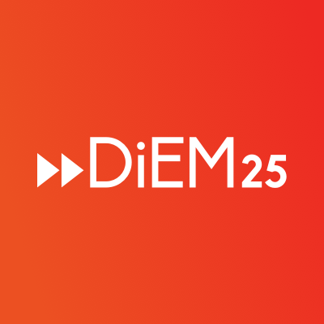

  

# Technological Sovereignty: Democratising Technology and Innovation

## Green Paper No. 1

## 21st August 2018

Authors: Kate McCurdy, Christoph Schneider, David Schwertgen, Joren De Wachter

Based on contributions by DiEM members

## Please, give us your feedback:

This is the first Green Paper of DiEM's pillar "Technological Sovereignty" within our effort to collaboratively develop the Progressive Agenda for Europe. As coordinators of this pillar we want to make the best of use of the two feedback cycles before Green Paper No. 3 which will be voted upon by DiEM members. We have chosen to leave some issues open and insert questions to DiEM's membership to invite for thorough feedback and to strengthen the dialogue within our movement on the democratisation of technology as an element of the democratisation of Europe. The collaborative policy making is central to DiEM's work - let's use our collective intelligence and enhance our capabilities for collaboration.

Please help us by following these guidelines for giving feedback:

- Concrete and constructive feedback helps us the most. Please ALWAYS refer to the number(s) of the paragraph(s) that you give feedback on, otherwise your comment may get lost.
- To foster the dialogue within our movement, please use the forum to give your feedback: https://discuss.diem25.org/t/green-paper-no-1-feedback-forum/14821
- If you do not want to use the forum you can also send us an email to techpillar@diem25.org
- Feedback that arrives until 4th September 2018 has the best chance of helping us - but we will look in the forum and the email account after that date. 

# 1. Introduction: Technological Sovereignty - We decide over our technologies 

1) Technological systems and the ways in which they are designed and governed are powerful ways to shape society. Technology has become a central form of social power and we have to democratise this power if we want to have collective control over our future reality. Technological changes have been accelerating and the private sector has an increasing influence over the directions of these changes. However, it is becoming ever more obvious that the concentration of capital-driven technological change is potentially harmful to the flourishing of people and a healthy democracy. 

2) Digitalisation, energy and mobility systems, housing, the future of work, of our health, of freedom, of equality, of our public sphere, of cities, of the environment and of states and democracy - the shape and quality of all of this is entwined with technological changes. Combining the democratisation of societies with the democratisation of technologies is therefore of utmost importance. Democratising technology means to shape and govern it democratically and for the common good. It means bringing technological power under democratic control and to use technological advances to benefit the many and to help societies and people flourish in the 21st century.

3) Democratising technologies can only be successful within an agenda to democratise societies. This is why DiEMincludes policies for technological sovereignty within its progressive agenda for Europe. Europe can become a beacon of hope if it unites political, social and technological progress. Especially digital technologies, however, can also help us to create systems and new institutions that update democracy to the needs and opportunities of the 21st century. Technologies have to be an integral part of the democracies of the future - as objects of democratic control and as tools to enhance our democratic powers. 

4) As a strong voice for democracy, transnational politics and progressive societal change, DiEM commits to head the debate on democratising technologies. This debate needs to be extended to all domains of technological change. Digital technologies are at the core of the ongoing transformationand most of this paper addresses policies for democratic digital change.But as a progressive movement we must also advance the debate on the democratisationof technology to other technological domains. Technologies such as gene editing (e.g.CRISPR), agricultural technologies, biotechnologies, neurotechnologies, energy technologies, robotics, pharmaceuticals, space and aeronautical technologies and many more need to come in focus.In the 21st century with accelerating technological change many technologies have the potential to radically alter the relationships between humans and nature. 

5) We need to have democratic and collective self-determination of how we as citizens want to shape these technologies, their development and their application. How do we supervise their risks? How do we make sure that their benefits are shared amongst the many? We have to get radical, i.e. go to the roots of the systems that shape and govern technologies, and find ways to democratise science, research and business to shape our societies' futures.

6) Technological development, however, is not a goal in itself - don't let the merchants of Silicon Valley's ideas tell you otherwise. Technology has to serve human progress and the common good. DiEM firmly supports human rights in the face of technology - the flourishing of humans, all humans, comes first, and technology second. Conceived in this way, technological development can be a formidable force for good. Technology is a key contributor to our civilization's ability to provide health, welfare, social interaction, freedom, safety and happiness. DiEMfirmly supports sound, positive and democratic technological development that benefits mankind, and rejects anti-technological thinking. 

7) However, this does not mean that all technological development is good. The negative consequences of technologies must be taken into account - it is not acceptable that profits from new technologies are privatised while their risks are socialised. In the face of accelerating technological change we need to safeguard and extend our individual and collective self-determination. We don't have to accept the control that designers and owners of technological systems or even technological systems themselves have over our lives. Instead, we'll have to invent and shape the democratic processes and institutions that help us to democratise technology and innovation. 

8) Technological sovereignty means to gain individual and collective self-determination over the choices and effects that technologies have on our lives and societies. Of course, technological sovereignty starts with individual people and their self-determination. But it doesn't end there. We have to invent ways in which organisations, municipalities, businesses, regional, national and European democratic institutions can be empowered to make self-determined choices and gain democratic control over technologies. And we have to invent new democratic institutions up to the task of governing technological change.

9) We need democratic control over the input we provide, which is used for technological ends - which aspects of our lives, which ideas, which needs and which aspirations influence technological ends? We need democratic control over the ways in which we are subjected to technology as workers, as citizens, as people in need, as politicians: How can we ensure equality and freedom in the face of growing technological influence over us? We need democratic control over the research and knowledge that powers technology - How can we find ways to publicly own and govern our collectively produced knowledge and support democratic forms of innovation that really address the pressing problems of our times?

## 2. Re:inventing a free, secure and decentralised internet ecosystem

10) Those who are old enough to have experienced the Internet in the late 1990ies will remember how radical it felt to have a decentralised (rhizomatic) network of interconnected computers unaffected by the hegemonic discourse of traditional media outlets and arbitrary governmental control. This Internet and its accompanying promise of a new, progressive age of unlimited and safe communication is long gone. Instead the Internet has become a medieval marketplace where everyone is keen to sacrifice safety, responsibility and sustainability for a quick dime or "like". 

11) We think that the progressive version of the Internet doesn't need to remain a nostalgic memory. In the last 20 years technologies and concepts have been developed that'll allow to facilitate a democratic, decentralised, less-commercialised, secure, anonymous and encrypted Internet. An Internet led and inspired by 21st century social and ethical standards. 

12) In the conceivable future the Internet as we know it will spread even further into the private and public life of every human being. A development that is commonly referred to as Internet of Things. Its underlying protocol IPv6 is able to provide 340 sextillion IP-adresses. That is an unimaginable amount of quadrillions of microcomputers, each of which could be connected to, and interact with, all the others via the Internet. Yet another reason why we consider a structural change of the Internet tobe of utmost importance.

13) We propose an evolutionary boost for the Internet which we want to achieve by sophisticated regulations and law amendments as well as publicly funded and facilitated structures. 

14) The structures proposed on the following pages will also implement a reasonable business model to attract private investors without sacrificing the safety and data autonomy of the user/citizens.

### 2.1. Long-term goals

#### 2.1.1. European Autonomous Data Network

15) The basic structure for our next level Internet will be the European Autonomous Data Network (EADN). By proposing this we identify the centralised structure of the Internet as a main issue for its current deformation. Contemporary cloud computer services are oligopolistic, unsecure and privately controlled structural nodes that are harvesting our data. At the same time this centralised server structure provides a ready-made framework for government surveillance. 

16) TL;DR: We are not safe on company servers.

17) As a solution we propose a decentralised, anonymous, autonomous, encrypted peer-to-peer-network. Think of a gigantic network of personal computers, tablets and smartphones helping to organise, structure and maintain a serverless and decentralised network. This network creates itself automatically with the initial help of bootstrap servers provided by the European Union. The data is stored on hardware and uses bandwidth provided by users of the network. All data on this network is fragmented and encrypted to ensure its safety and integrity. No client party has a complete overview over the network and thus the bigger the network becomes, the more secure it will get. To incentivise users to provided hardware and bandwidth there will be the option to implement a micropayment system (e.g. using a blockchain secured virtual currency).

18) To establish this European Autonomous Data Network we propose a European Save Networking Fund, set up by the EU that funds research on an open-source and easy-to-use solution implementing the specifications mentioned above. 

19) Furthermore we propose that the EU provides bootstrap servers and a minimum amount of storage capacity (storing encrypted data chunks) to get the network up and running.

20) To ensure the competitiveness of such a system further legislation might be necessary, both to ensure proof of competence as well as to prevent big players from distorting the decentralized structure of the network.

21) The public sector itself should be required to use these systems and to use hardware and software that has been fully audited. 

22) [Contributions [P6](https://github.com/kmccurdy/techdsc/wiki/P6-European-Autonomous-Data-Network), [P13](https://github.com/kmccurdy/techdsc/wiki/P13-Addition-to-proposal-Autonomous-Data-Network)]

#### 2.1.2. Platform independent and safe Social Media Infrastructure and Online Publishing

23) We believe that internet users have the right to express their opinion and to reach people who like their opinion and to get updates on their favourite celebrities' sex life without being subject to surveillance and targeted advertising. Also we believe that internet users have the right to build a sustainable network of online contacts without having to trust an internet oligopolist like google, twitter, facebook, instagram etc. on safeguarding their data. We need a system where it is safe for us to share whatever we want with our family and friends without the risk to unknowingly share it with third parties. [[P1](https://github.com/kmccurdy/techdsc/wiki/P1-Suggestion-for-a-European-Progressive-Media-Fund)]

24) At present the opposite is the case: Information about personal characteristics and behaviors is linked, combined and utilised across companies, databases, platforms, devices, and services in real-time. Individuals are constantly surveyed and evaluated, categorised and grouped, rated and ranked, numbered and quantified, included or excluded, and, as a result, treated differently. While this is happening the individuals in question might not even know about it. [[P8](https://github.com/kmccurdy/techdsc/wiki/P8-Tech-Pillar-Suggestions-DSC-Lower-Austria)]

25) While there are alternatives in place for nearly every service provided byan internet oligopolist (e.g. Mastodon, Diaspora etc.) the platform effect makes it is next to impossible to gather a critical mass of users on any of those alternatives - and thus makes them inefficient as an alternative. 

26) We think that as long as data v ending and targeted advertising is the main kind of revenue in the online realm any effective solution will always end up as a corrupted one. To prevent that and create the framework for the development of alternative social media and online content distribution systems we rely on two main principles:

- strong and effective legislation
- public funding for decentralised, encrypted and standardised solutions 

25) To protect our data and to keep the internet a fun and safe place.

26) One of the technologies we consider as promising to reach the objective mentioned above is an online publish/subscribe tool (e.g. an API) that operates from the user's own computer or smartphone and is not depending on servers, is not exposing interests to other people than to the intended ones and is protecting the flow of information in transit. It would be mandatory for services like e.g. twitter and facebook to supply interfaces e.g. a uniform simple document upload format, so that user could safely access their user base without having to reveal more information than necessary. Nevertheless the final objective is a truly distributed and private social network. 

27) To allow content producers to be rewarded for their work (be itart, text, image, video, music, podcast, live stream or whatever might come up in the future) we propose a mandatory anonymous micropayment systemby which any content can be bought for a few cents. (See e.g. taler.net for an example) [P4](https://github.com/kmccurdy/techdsc/wiki/P4-Input-DSC-Vienna2) [P18](https://github.com/kmccurdy/techdsc/wiki/P18-Intellectual-Property-for-Contributors)

28) Another crucial aspect of safe online communication is Identity Management. People needto be able to connect their identity across platforms while remaining able to choose the extent of the data being shared and even revoke access to this data if necessary. We call this feature Public Digital Identity. The Public Digital Identity shall be anonymous, decentralised, decoupled from other essential services and protected against arbitrary state access. [P16](https://github.com/kmccurdy/techdsc/wiki/P16-Public-Digital-Identity)

29) Accompanying these measures there must be stricter regulation on advertising, especially political advertising and advertising closely connected to the exercise of some right. 

30) Once those tools and accompanying legislation are implemented, targeted advertising and private surveillance will become impossible and unnecessary while an effective and fair revenue system will replace it.

### 2.2. Mid-term measures

31) Social media platforms are an important tool of debate and opinion making within the democratic discourse, that is too important and too sensitive to leave it in the hands of privately owned companies that do not have any fiduciary duty other than to their shareholders.

32) As it is highly unlikely that the specifications mentioned above will be able to be developed and flourish in the current internet and online platform ecosystem, we also envisage the European Save Networking Fund to facilitate a sovereign European Social Media Platform, based on our European ideas and values of privacy and security standards. This open source and open API based platform will provide a laboratory to design and introduce the server-independent autonomous data network, the online publish/subscribe tool, the anonymous micropayment systemand the public digital identity management. 

33) It will be a starting point to re-democratise online communication structures in order to deal with future digital challenges. The standards that will emerge from this platform will eventually become de jurestandard in the EU. We also see the European Social Media Platformas an opportunity to unbind small and mid-size companies and media outlets from their facebook dependency. [P19](https://github.com/kmccurdy/techdsc/wiki/P19--Reclaiming-Europe%E2%80%99s-digital-sovereignty-through-a-genuinely-democratic-social-media-platform)

34) To ensure the necessary critical mass of users we propose to couple the European Social Media Platform with a general Public Media Platformthat is described in detail in DiEMs "Vision for Culture"-Pillar. The aim of this multilingual content platform - a European public "Netflix" if you will - is, to store content produced by European public stations and to deliver it to all European citizensand to the people across the globe. The contents will be (automatically) subtitled and/or voiced-over to enrich a pan-European public debate in all European languages. The access to this platform will be free or backed by a small subscription fee. [P7](https://github.com/kmccurdy/techdsc/wiki/P7-European-Public-Media-Platform)

### 2.3. Short-term measures

35) [P2](https://github.com/kmccurdy/techdsc/wiki/P2-Input-DSC-Vienna1) [P4](https://github.com/kmccurdy/techdsc/wiki/P4-Input-DSC-Vienna2) [P9](https://github.com/kmccurdy/techdsc/wiki/P9-Questionnaire-submitted-by-Diego-Naranjo-(DiEM25-Belgium,-NC-member-and-Anna-Mazgal)) [P11](https://github.com/kmccurdy/techdsc/wiki/P11-Principles-for-technology-policy-and-framing-the-politics-of-technology) As long as the measures outlined above are being developed and deployed we propose short-term measures to limit the damage that the current structure of the internet performs. Some of these short term measures have already been part of the original draft of the e-Privacy Regulation. The e-Privacy Regulation is meant to be the main framework to protect online communication and is currently being "watered down" by the European Council.

36) DiEMers we need your help: We have to address cybersecurity and encryption and progressive policies addressing these. Send us your feedback and input!

#### 2.3.1. Privacy by design / Privacy by default

35) We are very concerned about the de facto standard of insecure communications via unencrypted emails and
messenger apps. Unauthorised access to a computer system is a crime under EU legislation (Directive
2013/40/EC). Following this logic we consider it unacceptable that unauthorised access to an individual's
computer system could be permitted by default.

36) We demand Privacy by design and Privacy by default as a mandatory standard for all hardware and software
developed, sold and used in the EU.

37) Privacy by design means that all stages of the creation of the hardware and software incorporates a high
level of protection of the users' privacy. Privacy by default means that our devices and software are set to
protect our data, with options to change this, if we wish.

38) Thereby we explicitly include the necessity to provide an incentive to develop technical solutions where
citizens can provide location data to so called location-based-services without any privacy risks. Technical
solutions based on local computation in the end-user's device should always be preferred over centralised
tracking.

#### 2.3.2. Reasonable Regulation of User Consent

39) Regarding User Consent we advocate a regulation that ensures that Software, Apps and Smart Devices are
seeking for consent as user-friendly as possible and only for permissions that are crucial to perform their main
task(s). Instead of being asked for general consent upon installation the user shall be asked to Opt-In for every
task that the Software/App/Smart Device wishes to perform on their device. „All-or-Nothing" consent - e.g. a
mandatory general consent for the Software/App/Smart Device to function - is most likely NOT in accordance
with the GDPR.

#### 2.3.3. Communication Data / Metadata Protection

40) Communication Data (email, voice mail, chat, videoconference, VoIP) is sensitive data and there shall be no
„legitimate interest" exception to use this data without explicit user consent (see above). Metadata processed
for security and QoS purposes should be anonymised as soon as possible and the storage of metadata should
be limited to what is strictly necessary for the designated purpose.

#### 2.3.4. Tracking Regulation

41) To protect users against third party tracking, we demand that so-called cookie walls - notification windows
that prevent access to a service if users do not agree to terms of service - should be prohibited. Also we
embrace a prohibition of the common practice of excluding users that use ad-blocking or likewise protection
software. We strongly demand this to be implemented asap to websites that offer public services, services that
are financed by public funds or medical services.

#### 2.3.5. Providers Disclosure Regarding Law Enforcement

42) Providers of electronic communication services should be obliged to publish all requests received by law
enforcement agencies or comparable state agencies. This publication should include the number of requests
received from law enforcement agencies, the legal justification invoked and the provider's response in a
meaningful aggregated format. We consider this to be a matter of public interest and transparency towards
public authorities.

#### 2.3.7. Improve app-usability for elder citizens / ensure barrier-free access across devices

44) Regarding the fact that older citizens or people with constrains in sight, hearing or movability we see it as a
requirement that all smartphone apps must also be usable from any computer. Such implementations would
need to be reasonably easy-to-use and secure (fulfilling the requirements mentioned above).

#### 2.3.8. Security flaws in private/public software systems

45) We demand to stop the common practice of state agencies to obtain, collect, create and store so called zeroday exploits (knowledge about flaws in security of products that are not known to the public or the vendor of
the product and thus cannot be fixed by the vendor). We furthermore propose to publicly fund security
research and create incentives for individuals that help find and/or fix software vulnerabilities. We are also
concerned about the use of proprietary code in software used by public institutions. We propose to publish the
source code to embrace the principle of full disclosure.

## 3. Democratising algorithms and data

50) The 21st century has seen an accelerating expansion of information technology in more and more domains
of everyday life, with citizens positioned both as sources of the data collected to accumulate privately-held
wealth and enable state and commercial surveillance, and targets of the resulting applications, which can
entail manipulation, exclusion, and other social harms. Unfortunately, this expansion of information
technology has not been accompanied by expanded democratic control, resulting in a massive concentration
of wealth, power, and surveillance capabilities in a few hands, and little accountability or oversight by the
public. This is the state of affairs today that DiEM seeks to change.

### 3.1. We need democratic control over data collection

51) Data collection has always carried a dual risk: inclusion in certain datasets can render citizens in general, and
members of marginalized groups in particular, vulnerable to being targeted for certain harms - but exclusion
from datasets can lead to other harms in turn. As a non-technical example, consider the decision to identify
oneself as a member of an ethnic minority on a government census. Not identifying one's ethnicity can lead to
the risk of exclusion: perhaps if members of one's ethnic group in the relevant district are undercounted,
crucial social services, such as linguistic and cultural support, will not be provided at sufficient levels to meet
the community's needs. On the other hand, including data on one's ethnic identity brings with it the risk of
being targeted by the state or an affiliated malicious actor, on which point history provides many tragic
accounts of the possible consequences.

52) How does information technology change data collection today? Mostly by making it easier than ever to
collect, store, and process data at unprecedented variety and scale, thus amplifying this dual risk in both
directions. To illustrate this variety, here's a partial list of the different kinds of data whose collection is
facilitated by digital technology:

- personal data, e.g. what you might enter into a form (name, age, sex, race, address, nationality, ...)
- biometric data, e.g. what you might use to unlock an iPhone (face, fingerprint, ...)
- personally authored content, e.g. what you might post on Facebook or send to a friend (text, audio, video, ...)
- behavioral data, e.g. how you interact with a device or website (GPS location, sites visited, time spent on news feeds, clicks on ads, grip on steering wheel, ...)
- behavioral biometric data, e.g. device interactions that identify you personally (speed of typing, direction of
mouse movements, ...)
- second-order inferred data, namely predicting a data attribute you did not provide (e.g. age or race) based on
other data about you (e.g. name or location)

53) As digital data collection extends to more and more arenas of life - our online communication and media
consumption, "smart" devices in our homes and workplaces, CCTV cameras on our streets, automotive
computer systems in our cars, and on and on - it becomes increasingly important that we, as citizens, know
who collects what data about us for which purpose, and retain the choice to withhold our data at will; this
transparency is needed to achieve meaningful accountability for information technology, and build public
trust that our data will not be used to exploit us. In cases where this trust cannot be established, we must
regulate data collection, and, if necessary, ban it altogether.

#### 3.1.1. Reining in the data brokers: regulatory measures

54) To gain control over our data, we need a strong regulatory apparatus to curtail its undisclosed circulation and misuse by third parties - ranging from states and powerful commercial interests to criminals and other bad actors. The GDPR offers an excellent starting point, and has already demonstrated that bold legislation can put the tech giants on notice - but we must go further!

55) - **End involuntary data trading**: For all domains in which data are collected, restrict the sale or access of
individual data to third parties unless the individual providing the data expressly consents to grant that
specifically named third party access, separately from granting general platform access (i.e. checking one box
to 'agree to terms and conditions' will not cover third-party sharing), and separately for each named third
party. ([P8](https://github.com/kmccurdy/techdsc/wiki/P8-Tech-Pillar-Suggestions-DSC-Lower-Austria), L26-27; [P9](https://github.com/kmccurdy/techdsc/wiki/P9-Questionnaire-submitted-by-Diego-Naranjo-(DiEM25-Belgium,-NC-member-and-Anna-Mazgal)), L24)

56) - **Restrict state-enabled corporate surveillance of the public**: From Lockheed Martin running data collection
for the 2001 and 2011 UK censuses to American police departments using Amazon's facial recognition software
for real-time database matching, "public-private partnerships" which purport to increase "efficiency" in fact
represent taxpayer money spent to funnel ever more data on nonconsenting citizens to unaccountable
corporations. These practices must be banned. In cases where assistance is required for core state data
processing capacities, such as the census, only partnerships with non-profit organizations should be
considered.

#### 3.1.2. Our data belongs to us: rethinking ownership in data collection

57) Our vision must be not only reactive, but constructive: how can we build the social
infrastructure and tools to make data collection inclusive, and harness the liberatory power of technology for
the public good?

##### 3.1.2.1. Fund development on open, secure protocols for data ownership:

58) The original foundation of the open web was open protocols, enabling the routing of communication within
and across networks - but platform monopolies have been able to build a proprietary data layer on top of
these protocols, leading to surveillance and lock-in for users. We must actively fund development on protocols
for secure routing and communication which empowers us to truly own our data, and be able to move it
between platforms at will. ([P1](https://github.com/kmccurdy/techdsc/wiki/P1-Suggestion-for-a-European-Progressive-Media-Fund); [P6](https://github.com/kmccurdy/techdsc/wiki/P6-European-Autonomous-Data-Network); [P16](https://github.com/kmccurdy/techdsc/wiki/P16-Public-Digital-Identity); [P4](https://github.com/kmccurdy/techdsc/wiki/P4-Input-DSC-Vienna2), L26; [P13](https://github.com/kmccurdy/techdsc/wiki/P13-Addition-to-proposal-Autonomous-Data-Network); [P17](https://github.com/kmccurdy/techdsc/wiki/P17-Proposal-Input-from-Carlo))

##### 3.1.2.2. Establish a public data commons:

59) Building and maintaining quality data resources, and ensuring their availability for applications in the public interest (e.g. scientific research, good governance analysis, etc.), provides a counterweight to the vast data stores of platform monopolies. Subject to appropriate protections, data produced by public institutions should be be made open and accessible by default; individual citizens and organisations should be able to contribute their data to the commons on a voluntary basis. The commons must ensure that data is nonpersonal or anonymised. Public institutions engaged in the collection of data for the commons must also conduct a thorough stakeholder analysis, with the aim of inclusive data collection along the dimensions of gender, race, class, nationality, sexual orientation, inter alia. Institutions should assess the risks for marginalized populations associated with representation in the dataset (inclusionary harm - risk of being targeted) versus absence from the dataset (exclusionary harm). ([P9](https://github.com/kmccurdy/techdsc/wiki/P9-Questionnaire-submitted-by-Diego-Naranjo-(DiEM25-Belgium,-NC-member-and-Anna-Mazgal)), L28, L122)

##### 3.1.2.3. Redistribute the value our data creates:

60) Platform monopolies have built empires of wealth on our data, but we haven't been invited to share in the
proceeds. This obviously must change, although how that happens is a topic for debate - so please, DiEMers,
give your feedback! Some thoughts:

- "Data as labor": [P12](https://github.com/kmccurdy/techdsc/wiki/P12-Work-force-and-data) suggests the model of treating data producers as workers, and ensuring compensation for the value generated by their data. This proposal resonates in certain aspects with other critiques of the online data economy; see also, for example, Jaron Lanier's "Who Owns the Future?", and the [Wages for Facebook](http://wagesforfacebook.com/) campaign. [P18](https://github.com/kmccurdy/techdsc/wiki/P18-Intellectual-Property-for-Contributors) also raises the possibility of improved recognition of economic value for content providers, under a broader conception of 'content'.
- However, there are some strong counterpoints: [P17](https://github.com/kmccurdy/techdsc/wiki/P17-Proposal-Input-from-Carlo) suggests simply banning proprietary data collection altogether, while [P9](https://github.com/kmccurdy/techdsc/wiki/P9-Questionnaire-submitted-by-Diego-Naranjo-(DiEM25-Belgium,-NC-member-and-Anna-Mazgal)) L28 cautions against "models based on "data ownership" that envision the possibility to to trade personal data for services and benefits. It would affect the vulnerable populations that have less resources and digital literacy and therefore enable forced trade of fundamental rights." - on which point a personal note of agreement from me: as most data collection for advertising and so on is focused on predicting consumption, it's fairly well established in the current data economy that *data from wealthier people is more valuable*, raising the risk that compensation for data could inadvertently end up reinforcing current hierarchies and power structures.

### 3.2. We need democratic control over data-driven applications

61) Independently of data collection, there is also a pressing need for greater oversight in the application of
data-driven information technology; for example, your picture may not appear in the image database used to
train a facial recognition system, but if that system is used on you, its biases and potential harms are of direct
concern to you. Nevertheless, while the scope of a data-driven application may differ drastically from the
context of the original data collection, in practice the two processes are often closely intertwined - especially
in the case of algorithmic technology, where application generally involves continuously collecting new data
to evaluate and refine system performance. In any event, information technology applications based on data
inherit the dual risks described above, and often constitute the point at which these harms are realized.

62) Algorithmic profiling based on given or inferred data attributes can lead to an individual being targeted for
those attributes - indeed, that is often the point. One possible harm resulting from targeting is
discrimination; for example, ads for lower-paying jobs
systematically delivered to profiles identified as women job-seekers. Another plausible harm is the
possibility an individual might be targeted for purposes of *manipulation* by third parties, ranging from
unscrupulous advertisers (for instance, online casinos targeting gambling addicts) to political propagandists
and promulgators of "fake news.")

63)On the other side of this dual risk, algorithmic systems trained on a dataset which excludes, or
underrepresents, a particular population - usually a historically marginalized group - offer another form of
discriminatory harm: reduced system accuracy on that population, or reduced system capacity to serve that
population.

64)Data-driven applications are used to inform incredibly consequential outcomes for citizen's lives, from media
consumption to job opportunities to eligibility for welfare benefits. To ensure they do not reinforce inequality and manipulation, but serve the public interest, we need
transparency and democratic governance over their use.

#### 3.2.1. Algorithmic accountability: Defining our rights

65) ([P20](https://github.com/kmccurdy/techdsc/wiki/P20-Proposal:-Algorithmic-Accountability)) With regard to the use of algorithms in everyday life, we demand that the following rights be
recognized:
66) - Right of interaction: Citizens have the right to know when they are or aren't interacting with an algorithm.
	- When an individual receives an outcome from a service that is based wholly or partially on algorithmic computation, this should be clearly and transparently communicated.
    - AI is not allowed to "conceal" itself in interactions with unknowing citizens.
    - On the other side, businesses are not allowed to "conceal" human data processing to users who believe themselves to be interacting with an algorithm.
67) - Right of equal treatment: Citizens have the right to be free from algorithmic discrimination.
     - If algorithmic services provide outputs of consistently lower value or quality to or about users coming from historically marginalized backgrounds, this constitutes discrimination .
     - Users should be able to compare outputs based on different demographic profiles (e.g. "would this search result be the same if I were to change the gender or age the algorithm has inferred for me?").
     - Given the risk of biased outcomes in high-stakes legal decisions, algorithmic decision-making should be banned from courtrooms and police interrogations.

#### 3.2.2. Algorithmic emancipation: Building an intelligent, accountable future

68) - **Public audits** ([P20](https://github.com/kmccurdy/techdsc/wiki/P20-Proposal:-Algorithmic-Accountability)): The EU shall develop an independent public institution to conduct algorithmic audits in
a transparent manner, with resources allocated proportional to estimated scope of a) affected citizens and b)
potential harms.

69) - **Opt-out** ([P20](https://github.com/kmccurdy/techdsc/wiki/P20-Proposal:-Algorithmic-Accountability)): An "algorithmic opt-out" rule shall be established: for any consumer algorithmic service, a user can
choose to receive an outcome with a "default" profile (i.e. with the user's personal/demographic attributes
and usage history removed from calculation).

70) - **Labor intelligence** ([P15](https://github.com/kmccurdy/techdsc/wiki/P15-Labor-Intelligence---Shared-Worker-Governance---Cooperative-Intelligence)): The EU shall fund a research institute working specifically at the intersection of
Artificial Intelligence and labor with the following mandate:
	- It shall explore and prototype intelligent systems with various axes of worker control (i.e. ranging from 'being designed along worker-friendly principles' to 'responsive to real-time worker input' to 'explicitly includes cooperative decision mechanisms for key decisions').
	- It shall partner with existing organizations, in particular cooperatives (platform and otherwise), to apply and test systems under real-world conditions.
	- It shall assess outcomes with particular attention to humanistic goals, quality of life, and workercentered perspectives, emphasizing the dignity and autonomy of workers.
	- It shall require particular attention to barriers faced by marginalized workers and workers from traditionally excluded backgrounds.

## 4. Free knowledge for democratic innovation - the role of Intellectual Property and education

### 4.1. What are the issues?

71) Intellectual Property (IP) is a system of government-created and enforced monopolies on certain aspects of
creativity and innovation. They include e.g. patents, copyright, trademarks, trade secrets, database rights, and
other similar rights.

72) The typical justification for IP is that it recognizes and protects the creator or innovator, by providing them a
monopoly that is limited in time and scope, so they can benefit from the ability to recover their investment.
After a time, the monopoly lapses, and the invention or creation becomes part of the public domain - i.e. the
classical freedom of enterprise, where everything that is not forbidden is allowed, regains its normal place in
the market. A second justification is the aspect of recognition of creators and inventors, and their
contribution to society.

73) There are a number of problems with IP today.

74) First, there is the continued expansion of the monopoly rights. Copyrights, originally 18 years long, now last
at least until 70 years after the death of the last contributing author (and for Disney a bit longer). Patents
used to be for narrow, technical applications, but now apply to methods (i.e. ideas), protocols, discoveries (e.g.
in the field of biology), software, and many other aspects that used to be non-patentable. In addition, the
standards for "novelty" are sometimes laughable. To give a classic example, in Australia, after a patent law
reform, someone managed to obtain a patent on the novel invention of the "wheel". Furthermore, new IP
rights are invented on a continuous basis: examples are database rights, trade secrets, performers rights and
the new secondary copyright for publishers in the draft Copyright Directive.

75) The public domain is under continuous attack from privateers.

76) Second, the link between the creator/innovator and the IP right is no longer functional. The full
transferability of IP rights has the practical effect of allowing hoarding of monopoly rights to the place in the
economic value chain where they produce the least benefit: with marketers and distributors. The actual
creators/innovators typically get little to no benefit from or recognition for their contributions.

77) The consequences are seriously problematic. For example, while public money provides for most R&D in
developing new drugs, we see that the R&D budget of large pharmaceutical companies is a fraction of their
marketing budgets, and most of their R&D budget is spent on research to "me-too" patents: patents on
slightly different versions of drugs that already exist, in order to artificially extent their monopoly position
(and pricing). It is a classical example of socializing the cost and risk of developing new drugs, and privatizing
the benefits. The same is true for other innovations and research at universities and other research centres
funded with public money. Far too often, the results of such publicly funded research is privatized through the
creation and transfer of IP rights to privately held spin-offs.

78) Third, IP rights have a number of negative effects on the economy and society. The rent they extract
generates huge transfers of money to a limited number of corporate monopoly holders and their
shareholders. This leads to a very regressive income distribution and significantly adds to economic inequality.
People who work pay rent to people who hold government-created monopolies on the proceeds of that work
and get rent as unearned income purely as unproductive rights holders.

79) IP rights, today, also significantly slow down innovation. They allow large established businesses to use evergrowing monopoly rights to block access to their market to newcomers or competitors. Initiatives like the draft Copyright Directive allow copyright to be used as a way to censor content, [reducing ever more the
freedoms](https://www.opendemocracy.net/can-europe-make-it/renata-avila-joren-de-wachter-christoph-schneider/eu-is-killing-our-democratic-sp) that the Internet was supposed to give us.

80) In the discussion on the draft EU Copyright Directive, the monopoly holders of content (the entertainment
industry) are fighting with the monopoly holders of the tech industry. But who defends the interests of
consumers, citizens and creative people?

81) In addition, in many countries IP monopolies actually benefit from tax exemptions or preferential
treatment, allowing large multinationals to shift their profits, and benefit from tax forum shopping.

### 4.2. What does DiEM propose as fundamental solutions?

#### 4.2.1. Break the cycle of "socializing costs, privatizing benefits"

82) Knowledge, R&D and innovation that are funded by public money should remain "common".

83) In practical terms, this means that content created by public funds, such as scientific research, should be, by
default, available under systems like the most permissive creative commons licenses.

84) Any software code whose development is funded by public money should be made available under Free and
Open Software licenses.

85) This has several benefits: it provides for independence from non-EU based suppliers, it increases the security
and stability of the software and it breaks the de fact monopoly of many technical platform providers.

86) While exceptions can be possible under strict circumstances, any such exceptions must be accompanied by a
practical way for the public investment to share in the proceeds of any monopoly granted. An example could
be that any spin-off created to monetize the result of publicly funded research, has to grant, on incorporation,
20% of its shares as non-voting shares to the authorities that funded the research.

#### 4.2.2. Break the cycle of IP monopolies encroaching on the public good

87) Introduce a fundamental "Right to Repair": the buyer of a product or service has the right to repair any
aspect thereof (or have it repaired for them) and IP rights cannot be used as a means to block such Right to
Repair.

88) Introduce the principle of Open Standards. Technical standards must be documented so that interoperability
is ensured, and they may not be subject to IP monopolies.

89) Reduce maximalist copyright tendencies: harmonize exceptions to copyright, introduce a "fair use" concept
with broad application, based on freedom of speech. Force collecting societies to provide full transparency on
the rights they claim to represent, the cost they charge, and how much they pay to the right holders.

90) Reverse the burden of proof in copyright: unless something can be shown to be clearly under copyright, it
must be in the public domain.

91) Reform the Berne Convention, and make copyright subject to registration, and payment of a fee that
increases with time.

92) Ban the concept of IP rights on anything invented or created by machines.

93) Open a debate on the patent system: should it be abolished, or should it be reformed so that it can fulfill its
original ambition: reward inventors, and share the knowledge of their inventions throughout society.

94) Declare any information "found in nature" to be in the public domain. Biological information carriers such
as DNA or RNA must be classified as "Open Content" languages, and not subject to any IP right.

#### 4.2.3. Break the cycle of hoarding monopoly rights by distributors and marketers

95) Limit the enforcement of IP rights to the actual inventor/creator, not their assignees/licencees. This will
increase their recognition, and ensure that they actually benefit from the IP monopoly that government
creates for them.

96) Abolish any tax incentives to create, transfer or collect IP rights.

97) Create a special tax on the rental income of existing IP rights as a contributory funding for the Universal
Basic Dividend as proposed in the European New Deal.

98) Make it much easier to disable a patent because it does not cover something that is actually novel.

#### 4.2.4. Short term solutions:

99) Reversing the tax treatment of IP is the easiest immediate step to take. This means that any preferential tax
treatment of royalties or other income (rent) deriving from IP, such as lower tax rates or higher exemptions on
such income, must immediately be withdrawn. They should be replaced by the opposite: income from IP (rent)
must be taxed preferably at higher rates, and more progressively, than income from selling actual goods or
services.

100) In addition, the draft EU Copyright Directive must be fundamentally reviewed, in order to obtain much
more balanced rights of users, re-users, creators and innovators. A European "fair use" concept must be
created, with broad applications, and based on the fundamental freedom of speech.

101) With immediate effect, public authorities must switch, where possible, to using open source software.

102) Any patent on software functionality may only be awarded subject to full disclosure of all source code
related thereto.

103) Public funding of open source software can be envisaged.

### 4.3. Education and Technology

#### 4.3.1. What are the issues?

104) Knowledge is power. If we want to democratize technology, and start the debate around how society
determines which technologies are developed, which are supported, how they are regulated and whether
some should be banned, we need to ensure that informed debate is a priori possible.

105) Leaving everything to the experts is not a solution. Their expertise always comes with opinions and values
attached to it, with a view on society and how it should function, in other words with a political view. Even if
they deny it (especially if they deny it), the political views of technical experts should be viewed with normal,
democratic skepticism.

106) Decisions are never without value. But in order to be able to judge the values that are applied in decisions
on technology, it is often necessary to understand, at least to a certain extent, the technology concerned.

107) Democratic debate assumes "Mündigkeit", and this is where education plays a key role.

108) Education, not just of the young. Also of the elderly, who sometimes are lost with all those new
technologies popping up all around them. And of the civil servants who have to devise the administrative
framing of the political discussions around technology. How a problem is presented, often within a certain
bureaucratic system, is often key to the solutions that are deemed "possible".

109) Finally, we know there are serious issues of gender equality and representation in science and technology,
and in the many government, quasi-government and private bodies that take key decisions in this area.

110) So the key issue is: how do we, as a society, promote and ensure the knowledge necessary for a proper
democratic debate around technology?
111) (contributions [P2](https://github.com/kmccurdy/techdsc/wiki/P2-Input-DSC-Vienna1), [P3](https://github.com/kmccurdy/techdsc/wiki/P3-Proposal-for-reform-of-education-media--and-technology-related-subjects-and-topics-in-School,-university-as-well-as-the-public-sector-like-libraries), [P8](https://github.com/kmccurdy/techdsc/wiki/P8-Tech-Pillar-Suggestions-DSC-Lower-Austria))

#### 4.3.2. What does DiEM propose as fundamental solutions?

##### 4.3.2.1. Modify education curricula to include principles of knowledge towards technological sovereignty

112) Education systems and curricula should be updated to ensure that education allows for students to obtain
"Mündigkeit" on technology matters.

113) This means not only teaching about the basic principles underpinning technology as such (a minimum of
STEM for every student), but also explaining the relationship between technology and society, e.g. by pointing
out alternative systems such as the commons and other economic models of technological development and
management.

##### 4.3.2.2. From open standards to technology that can be understood

114) The principles of open standards and the Right to Repair lead us to a possible "right to understand". It
should be investigated whether it can be made mandatory for owners of technology to provide sufficient
information to the public so that the general principles of how their technology works can be understood by
people with sufficient training in the relevant area.

115) Of course, there would be justified concerns around safety and security, but, as we know from open source
software, it is typically proprietary (and secret) technology that presents the highest risks to security,
vulnerability to hacking and abuse of its flaws.

##### 4.3.2.3. Technology for everyone

116) The democratic debate around technology should not be limited to the initiated. Use of technology and its
consequences on society should not be the prerogative of technocrats, and the debate around technology
should be open to all.

117) Public authorities should invest in order to ensure that the debate on how technology is regulated is not
done in backrooms full of lobbyists of the interested industry, but by all stakeholders, and provide sufficient
information and transparency on the process to ensure that proper debate is possible. Initiatives for
technology assessment and public participation in science and technology need to be strengthened and in
some cases made mandatory.

118) In addition, it should be reviewed whether other stakeholders (consumers, the public at large, public
authorities) should have observation functions or guaranteed representation in the decision making bodies
(board of management) of companies that make technological decisions with a significant impact on society
(just like in some countries, governments are entitled to appoint observers to the boards of financial
institutions under certain conditions).

119) There is a growing sphere of organisations that foster public and open uses of technology. Europe has
hundreds of maker spaces, FabLabs, museums and educational institutions that experiment with technology
and knowledge oriented towards commons and society. New ways to support such projects should be found.

120) (Contributions [P3](https://github.com/kmccurdy/techdsc/wiki/P3-Proposal-for-reform-of-education-media--and-technology-related-subjects-and-topics-in-School,-university-as-well-as-the-public-sector-like-libraries), [P9](https://github.com/kmccurdy/techdsc/wiki/P9-Questionnaire-submitted-by-Diego-Naranjo-(DiEM25-Belgium,-NC-member-and-Anna-Mazgal)), [P2](https://github.com/kmccurdy/techdsc/wiki/P2-Input-DSC-Vienna1))

#### 4.3.3. What are the short term actions?

##### 4.3.3.1. Open up the debate on technological regulation

121) Introduce a general principle that any EU regulatory process (legislative, administrative or otherwise) that
relates to how technology affects society should be fully transparent, not only in relation to the content of
what is decided, but also in respect of the process (e.g. meetings with lobbyists, etc).

##### 4.3.3.2. Start a process on how democratic debate on technology can be strengthened

122) From a "right to understand" a specific technology to understanding how both existing and developing
technology is due to affect our society, there is a serious lack of democratized knowledge allowing people to
form opinions and engage in democratic debate.

123) Technocracy, as a principle, must be countered by the legitimate demand of technological sovereignty in a
democratic system.

124) DiEM proposes that we start taking the necessary steps to enable this essential correction of our current
technocratic, black-box approach to technology.

## 5. Democratic decisions on technology and a collaborative economy

125) Every technological development is the result of choices. Choices made by governments, researchers,
investors, consumers, manufacturers, distributors, users and many others. No technology is god-given or given
by the "invisible hand of the market", and no technology is neutral: it is is always value-laden. The way we
fund, adopt, use and regulate technology, or not, reflects society's choice of its values and priorities. However,
decisions in research and innovation currently reflect the worldviews and interests of technocratic
researchers, policy-makers and above all venture capitalists that want to take research "to the market", i.e.
want to maximise their profits.

126) DiEM believes that we need to democratise research and the selection of priorities and strategies for
research and innovation. This entails democratising funding decisions for research in politics, science and
industry. Democratising decision-making in technology is necessarily an effort to democratise the science
system and the economy. We must consider how these choices are rooted in values, and openly discuss and
resolve them in a democratic way. The agenda of the technology and values debate should be open and
inclusive, and not set by research and the technology industry itself. To every technological option there are
always alternatives - including non-technological forms of change and problem solving. We must establish the
necessary democratic instruments and institutions capable of addressing the complexities of inclusive 21st
century technologies. [[P11](https://github.com/kmccurdy/techdsc/wiki/P11-Principles-for-technology-policy-and-framing-the-politics-of-technology)]

### 5.1. Democratising technocratic decision-making in research and innovation

127) DiEM proposes using mission-oriented public funding to address the crises of the European economy. As
part of its European Green New Deal, DiEM proposes funding Green Investment‐led Recovery and setting up a
new agency for managing and funding Europe's Green Transition and Green Energy Union. More such
instruments need to be devised that make use of the risk-taking, mission-oriented funding powers of public
institutions. But we need to democratise these institutions as well.

128) The European Union is already a major funder and decision-making body that shapes the research and
innovations that affect our lives. In the ongoing program "Horizon 2020" the EU has been spending 80 billion
&#8364; to fund research and innovation in the years 2014 to 2020. The following program "Horizon Europe" entails
100 billion &#8364; for research and innovation funding in the years 2021 to 2027. These are vast sums of money.
While the programs are proposed by the European Commission and debated in the European Council and the
European Parliament, the individual funding decisions are taken in a technocratic manner by Brussels
bureaucrats, lobbyists and scientific experts. We have to put European citizens in charge: research and
innovation need to become accountable to citizens and their needs and expectations.

#### 5.1.1. Proposal: Participatory budgeting platform for research and innovation

129) This digital platform will be a 21st century institution that democratises the funding of research and
innovation, giving citizens a stronger say through participatory budgeting on a transnational level.

130) **Democratise funding: citizens crowd funding**

131) The platform needs to contain a crowd funding system that allows European citizens to allocate public
money, e.g. from the EU's "Horizon Europe", through their decisions on the platform. Every EU citizen that
uses the platform has the same amount of public money to allocate to research or innovation projects. It is
imperative that research and innovation are not only focused on "high-tech" on this platform but that
different forms of research and innovation, including technological, social and cultural innovation, are
addressed. The projects apply with their proposals and a sum of money that would allow them to start the
work. As in crowdfunding, if enough citizens give money to a proposed project it is successful and gets money
from the fund.

132) A significant proportion of public funds for research and innovation needs to be put into this platform to
give citizens a voice. One third of the overall EU budget for research and innovation or of new public funding
instruments, i.e. around 30 billion &#8364;, seems reasonable. The other two thirds could be allocated as usual
through the science system or through existing EU institutions.

133) **Democratise agenda setting: citizens' needs crowdsourcing**

134) The platform should also enable citizens to identify problems to be addressed through research and
innovation. Problems would be freely submitted, then democratically ranked on the platform. The top ranking
problems are then turned into pillars for the funding side of the platform such that researchers and
innovators can apply with proposals targeting specific pillars. Localised forms of problem sourcing and money
allocation could be introduced in the platform as well, such that participatory agenda setting and budgeting
on a national, regional or municipal level could take place.

135) **Ensure Participation**

136) If the platform is simply open to all citizens, well-educated and higher-earning people would probably
dominate its usage, as seen in most forms of citizen participation. One way to counter this could be forming a
representative decision-making body through drawing several thousand citizens from Europe by lot - and by
paying them a sum of money as compensation for participating. Furthermore, the platform needs to have its
content in all languages of the European Union. [[P10](https://github.com/kmccurdy/techdsc/wiki/P10-National-and-Regional-Online-Voting-Platform), [P14](https://github.com/kmccurdy/techdsc/wiki/P14-Proposal-for-a-%25E2%2580%259ECitizen%25E2%2580%2599s-Research-and-Innovation-platform%25E2%2580%259C)]

### 5.2. Foster a collaborative and democratic economy

137) The problem of decision-making in research and innovation extends beyond funding agencies and
scientists. Most of the decisions on innovations are taken within the economic sphere by capitalists. The Big
Tech companies of the world are commanding the largest planned economies in history - not only their
monopolies but also their use of digital technologies to organise their economic processes work outside of a
market as we know it. This certainly is a grave threat to democracy and fair competition.

138) To democratise research and innovation we also need to find ways to democratise the economy and to
foster more decentralised economic arrangements, collective decision-making and structures for shared
responsibilities. In short, we need to democratise economic decision making. With the help of digital systems,
new ways of organising businesses, innovation processes and collaboration, and collective ownership become
possible. We need to tap into these and help more a more democratic economy and more democratic
technologies to emerge.

139) Every technology is the result of collaboration. Collaboration between developers, public institutions,
users, researchers, citizens, businesses and more. Innovative societies foster collaborations. And they have
public institutions and investments that foster the exchange of ideas and provide resources for the new to
emerge - technologies depend on the public. For too long have regulations from the time of the first industrial
revolution and power structures aided in monopolising and privatising technology. Artificial boundaries that
block or slow down the creative sharing of technology damage society. The more value and technology are
shared, the more they can create value in return. [[P11](https://github.com/kmccurdy/techdsc/wiki/P11-Principles-for-technology-policy-and-framing-the-politics-of-technology)]

140) Digital technologies can help to create new and more democratic organisational forms for economic
activity and for governing infrastructures. Very promising ideas and developments are ongoing in the
movement for platform cooperativism where the aim is to make workers, users and other stakeholders the
owners of platforms that coordinate economic activities, e.g. taxi drivers owning and operating their own
digital platform instead of working under dire conditions for Uber.

141) Digital technologies are already being used to coordinate and to govern economic processes. This hints at a
big opportunity to shape economic systems in the 21st century. What if we take these technological
capabilities and use them radically differently than their current masters: to shape economies that foster
social justice and help to keep our production and consumption within planetary boundaries? What if with the
technologies of an Internet of things and so-called "artificial intelligence" we could also build coordination
mechanisms that are democratically controlled (see also 3.3.1 propossal on "labor intelligence") and move
certain economic activities and uses of infrastructures beyond the market? How could ideas such as that of an
"economy for the common good" be implemented in such systems? [[P2](https://github.com/kmccurdy/techdsc/wiki/P2-Input-DSC-Vienna1)]

142) DiEMers we need your help: How can we use technology to shape a new and more just and sustainable
economy? How can a cooperative and collaborative economy be supported through digital technology? Ideas,
examples? What else is needed beyond technology?

## 6. Next steps and open issues

143) Give us your feedback on any of the paragraphs and ideas in this paper - and contribute further ideas where
necessary.

144) Here's an overview of what we consider as still open issues that we need to address:

145) How can we strengthen and shape the debate on technological sovereignty by explicitly addressing other
technologies besides digital technologies? How to democratise science, business and other institutions that
shape technology?

146) We have to address cybersecurity and encryption and progressive policies addressing these. Send us your
feedback and input!

147) Which route for data ownership should we take? See 3.1.2.3

148) Further ideas on how to democratize AI and use it for the common good.

149) How do we, as a society, promote and ensure the knowledge necessary for a proper democratic, inclusive
and diverse debate around technology?

150) Which stronger policies could address gender equality, inclusion, diversity and fostering technological
literacy in relation to education, the science system and technological development?

151) How can we use technology to shape a new and more just and sustainable economy? How can a cooperative
and collaborative economy be supported through digital technology? Ideas, examples? What else is needed
beyond technology?

152) &#8230; and you tell us what we are still missing.
